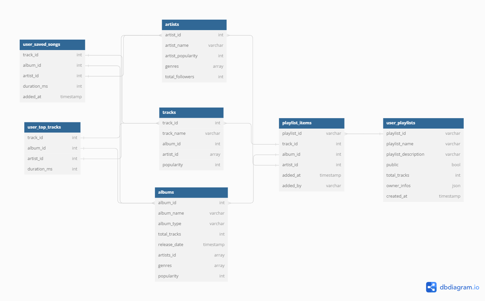

# ELT process - Spotify API Data

## Kubernetes
### How to Install 
> 1. Download the latest stable version at https://kubernetes.io/docs/tasks/tools/install-kubectl-windows/
> 2. Add the kubectl.exe on the path of enviroment variables

To facilitate the configuration of the cluster, I used **minikube**, which is a local Kubernetes, focusing on making it easy to learn and develop for Kubernetes.
To download it, you will need:
> 1. 2 CPUs or more
> 2. 2GB of free memory
> 3. 20GB of free disk space
> 4. Internet connection
> 5. Container or virtual machine manager (in my case, I used Docker)

## Chocolatey
Chocolatey aims to automate the entire software lifecycle from install through upgrade and removal on Windows operating systems. 

### How to install
> 1. Open Windows Powershell as an administrator
> 2. Type the command:
``
Set-ExecutionPolicy Bypass -Scope Process -Force; [System.Net.ServicePointManager]::SecurityProtocol = [System.Net.ServicePointManager]::SecurityProtocol -bor 3072; iex ((New-Object System.Net.WebClient).DownloadString('https://community.chocolatey.org/install.ps1'))
``

## Kubectx e Kubens
- **kubectx** is a tool to switch between contexts (clusters) on kubectl faster.
- **kubens** is a tool to switch between Kubernetes namespaces (and configure them for kubectl) easily.
  
To install, you will need to have chocolatey installed as well. After that, just type ``choco install kubectlx`` and ``choco install kubens`` on powershell

## Helm

Helm helps you **manage** Kubernetes applications — Helm Charts help you define, install, and upgrade even the most complex Kubernetes application.

### How to install
`` choco install kubernetes-helm ``

## Commands used to create the minikube instance and configurate the airflow

-- First, we need to create our k8s cluster: ``minikube start``

-- Installing airflow on helm: ``helm repo add apache-airflow https://airflow.apache.org/``

-- By default, airflow points directly to its own DAGs repository. So, we need to *copy* the helm package to our local machine, instead of just downloading it directly to the cluster:
```
helm pull apache-airflow/airflow
tar zxvf airflow-1.11.0.tgz
```

-- Everytime we install helm, it points to a file called values.yaml

-- On the case of the airflow, at the end of the file at the part of  ``gitSync``, it points directly to the git file of the own airflow.
We need to alter that part, so that we can create our own DAGs.

-- In case of private repository: create a file named encoding with git's **name** and **token**, and update yaml with the following command: ``kubectl apply -f git-secret.yaml -n airflow``

-- In case you already have a helm, but you want to alter some values: ``helm upgrade --install airflow airflow``

-- After that, execute the command: ``helm install airflow airflow -n airflow --create-namespace``

-- Check if the pods on the namespaces are ok ``k9s -n airflow``

-- Change the default namespace ``kubens airflow``

-- Access the airflow ``kubectl port-forward svc/airflow-webserver 8080:8080``

## Database diagram

In order to build the pipeline with Airflow, we need to put the data somewhere. So, we will be using Google Big Query.
The following image shows our tables and their relationships.



## References
https://www.youtube.com/watch?v=twGSLGpxAEo

https://helm.sh/docs/intro/quickstart/

https://github.com/ahmetb/kubectx?tab=readme-ov-file#windows-installation-using-chocolatey

https://minikube.sigs.k8s.io/docs/handbook/controls/
